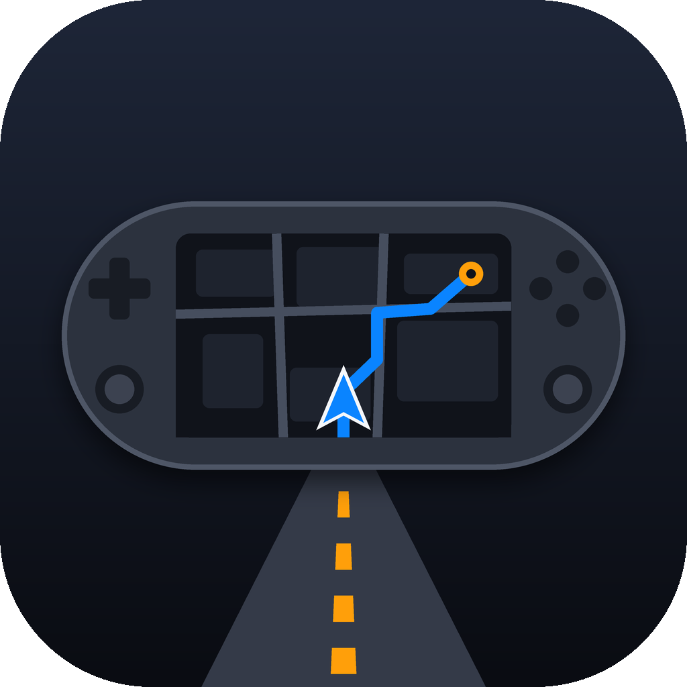
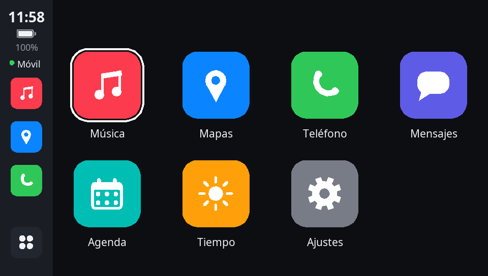
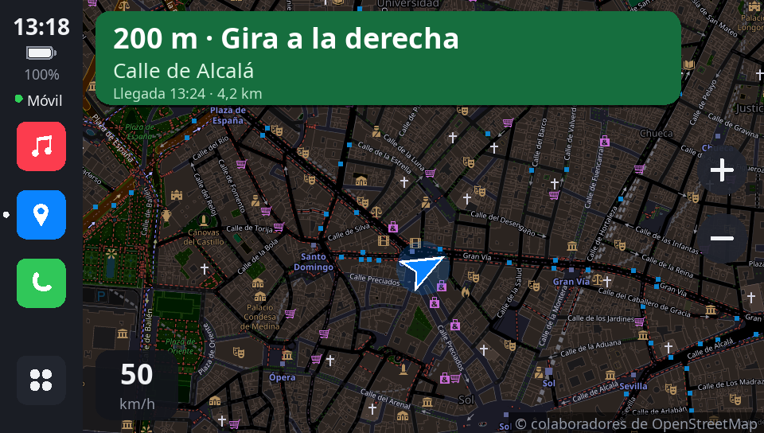
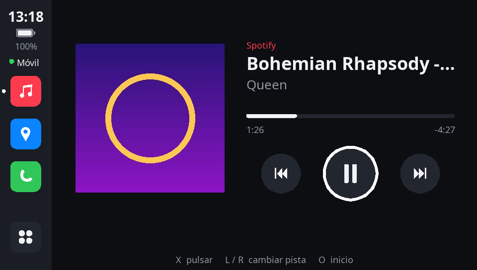
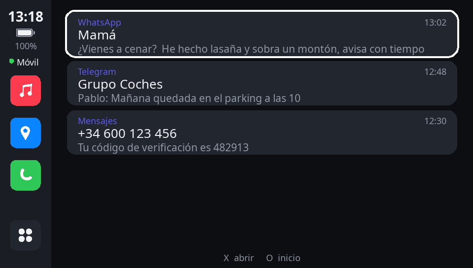

<p align="center"></p>

<h1 align="center">VitaCar</h1>

<p align="center">Convierte tu PS Vita en la pantalla del coche, al estilo CarPlay, conectada a tu móvil Android.</p>

<p align="center">
  
  
  
  
</p>

VitaCar es una app homebrew para PS Vita y una app compañera para Android. El móvil envía a
la Vita la música, los mensajes, las llamadas, el GPS, las indicaciones de navegación y el
tiempo, y desde la Vita se controla todo con la pantalla táctil o los botones.

> **Estado: en pruebas.** Ya se ha probado en una PS Vita y un móvil Android reales: la música,
> los controles y las indicaciones de Google Maps funcionan. Aún hay limitaciones conocidas
> (ver [Problemas conocidos](#problemas-conocidos)). Si lo pruebas, cuéntanos qué tal
> (ver [Feedback](#feedback)).

## Descarga

En [Releases](../../releases) están los instalables:

```
VitaCar.vpk   -> para la PS Vita (instalar con VitaShell; requiere HENkaku/Ensō)
VitaCar.apk   -> para el móvil Android (8.0 o superior)
```

## Puesta en marcha

1. **Móvil:** instala `VitaCar.apk` (permite «instalar apps desconocidas»). Ábrela y concede
   todos los permisos de la lista. En Realme/Oppo/Xiaomi, sigue también la tarjeta de batería.
   - **«Acceso a notificaciones» es imprescindible**: sin él no se ven la canción que suena
     (título, artista, portada), los mensajes ni las indicaciones de Google Maps. Los botones
     de música sí funcionan sin él, porque usan las teclas multimedia de Android.
   - Como la app no viene de Play Store, Android bloquea ese permiso y muestra *Ajuste
     restringido*. Para desbloquearlo: Ajustes › Aplicaciones › VitaCar › ⋮ › **Permitir
     ajustes restringidos** (pide el PIN o la huella). Después vuelve a la app y actívalo.
2. **Una WiFi de 2,4 GHz** compartida por el móvil y la Vita (la Vita no ve la de 5 GHz). Sirve:
   - **El punto de acceso del propio móvil Android** (sin apagado automático). Funciona aunque
     el móvil no tenga datos, y es lo más sencillo: la Vita lo encuentra sola.
   - **Cualquier otra WiFi**: la de casa o el punto de acceso de otro móvil (en iPhone, activa
     «Maximizar compatibilidad»). En este caso, de momento, hay que indicarle a la Vita la IP
     del móvil con un archivo (ver el paso 5).
   - No sirven las redes que aíslan a sus clientes (invitados, hoteles, cafeterías…).
3. **Vita:** Ajustes › Red › Configuración de Wi-Fi › conéctate a esa red.
4. En la app del móvil pulsa **Iniciar**. Abre VitaCar en la Vita: el punto «Móvil» de la
   barra lateral se pone verde.
5. **Solo si la Vita se queda en «Buscando»:** en la app del móvil, al pulsar «Iniciar», aparece
   «Direcciones de este móvil». Copia la que lleva `(wlan0)`, por ejemplo `192.168.1.92`. Crea
   un archivo de texto `phone_ip.txt` que contenga solo esa IP y cópialo en la Vita (con
   VitaShell) a `ux0:data/VitaCar/phone_ip.txt`. Si el router le da otra IP al móvil más
   adelante, actualiza el archivo; para volver a la búsqueda automática, bórralo.

El sonido sale del móvil, que se conecta al coche como siempre (Bluetooth o AUX). La Vita no
reproduce sonido (ver [Problemas conocidos](#problemas-conocidos)).

## Qué hace cada app

| App | Funciona con |
|---|---|
| Música | Cualquier reproductor del móvil (Spotify, YouTube Music…): título, portada, progreso, anterior / pausa / siguiente |
| Mapas | GPS del móvil, mapa de OpenStreetMap en modo noche, velocidad, zoom; indicaciones (texto) de Google Maps / Waze cuando hay una ruta activa en el móvil |
| Teléfono | Estado de la conexión; llamada entrante a pantalla completa (contestar / rechazar); colgar |
| Mensajes | Notificaciones del móvil, aviso emergente, respuestas rápidas (WhatsApp, Telegram…), borrar |
| Tiempo | Open-Meteo según tu ubicación |
| Ajustes | Batería, móvil conectado, red |

Las teselas del mapa que llegan del móvil se guardan en `ux0:data/VitaCar/tiles`, así que
las zonas ya vistas funcionan después sin conexión.

## Problemas conocidos

| Problema | Causa y solución |
|---|---|
| La Vita se queda en «Buscando» en una WiFi que no es el punto de acceso del móvil | La búsqueda automática aún no funciona en la Vita real: el móvil sí se anuncia en la red, pero la Vita no recibe el aviso. Mientras se corrige, usa `phone_ip.txt` (paso 5 de la puesta en marcha). |
| No se ve la canción ni los mensajes, aunque los botones de música funcionan | Falta «Acceso a notificaciones» (paso 1 de la puesta en marcha). |
| No aparecen las indicaciones de Google Maps | Hace falta el mismo permiso y una **ruta iniciada**: con Maps solo abierto no hay indicaciones. |
| El mapa muestra las indicaciones, pero no dibuja la ruta | Google Maps no comparte la ruta con otras apps, solo el texto de la indicación. Está previsto que VitaCar calcule y dibuje su propia ruta. |
| El sonido sale por el móvil, no por la Vita | Por ahora es así. Se estudia una opción experimental para enviarlo a la Vita, pero Android no deja capturar el sonido de algunas apps (como Spotify), de las llamadas ni de las indicaciones por voz. |
| El mapa va algo lento | Cada tesela se descarga en el móvil, viaja por WiFi y la Vita la descomprime y oscurece para el modo noche. Las zonas ya vistas cargan más rápido. Está previsto mejorarlo. |
| La app es solo para Android | iOS no permite a otras apps leer las notificaciones ni controlar la música, así que no hay versión para iPhone. Un iPhone sí puede servir para compartir la WiFi (ver la puesta en marcha). |

## Próximamente

- Búsqueda automática del móvil en cualquier WiFi, sin `phone_ip.txt`.
- Ruta dibujada en el mapa: destino elegido en el móvil o compartido desde Google Maps.
- Mapa más fluido.
- Sonido por la Vita (opción experimental).

## Controles de la Vita

| Botón | Acción |
|---|---|
| Pantalla táctil | Todo; deslizar para recorrer los mensajes |
| Cruceta | Mover el foco · en Mapas: zoom |
| X | Abrir / pulsar · contestar llamada |
| O | Volver |
| L / R | Pista anterior / siguiente · en Mapas: zoom |

## Compilar

### Vita

VitaSDK en `~/vitasdk` y CMake en `~/.local/bin`:

```sh
source env.sh
mkdir -p build && cd build && cmake .. && make      # build/VitaCar.vpk
```

Con [vitacompanion](https://github.com/devnoname120/vitacompanion) en la consola:
`cmake -DVITA_IP=192.168.x.x .. && make send` sube el ejecutable y relanza la app.

### Android

```sh
cd companion-android
JAVA_HOME=~/Android/jdk-17.0.20.1+1 ./gradlew assembleRelease
# app/build/outputs/apk/release/app-release.apk
```

Firmado con la clave de depuración (uso personal, no Play Store).

## Estructura

```
src/main.c           Bucle principal y entrada
src/screens.c        Barra lateral, inicio, avisos emergentes, llamada entrante
src/app_*.c          Música, Mapas, Teléfono, Mensajes, Tiempo y Ajustes
src/phone.c          Conexión con el móvil (hilo de red, protocolo, estado)
src/net.c            Sockets: sceNet en la Vita, POSIX en el PC
src/tiles.c          Teselas: memoria, tarjeta y móvil; modo noche
src/ui.c, icons.c    Dibujo, texto con caché y recorte, iconos vectoriales
src/third_party/     cJSON (MIT)
companion-android/   App Android (Kotlin, sin dependencias externas)
docs/PROTOCOLO.md    Protocolo entre Vita y móvil
tools/gen_logo.py    Logo de la app
tools/gen_sce_sys.py Icono y LiveArea a partir del logo
```

## Feedback

Este proyecto se hace por y para la comunidad. Toda ayuda cuenta:

- **¿Algo falla?** Abre un [issue de fallo](../../issues/new/choose) indicando modelo de Vita,
  móvil y versión de Android.
- **¿Una idea?** Propón una mejora en [Issues](../../issues/new/choose).
- **¿Quieres programar?** Los *pull requests* son bienvenidos.

## Licencia

VitaCar se distribuye bajo la [PolyForm Noncommercial License 1.0.0](LICENSE): puedes usarlo,
estudiarlo, modificarlo y compartirlo libremente, **pero no con fines comerciales**. No se
puede vender ni incluir en productos de pago.

## Aviso legal

VitaCar es un proyecto independiente y no está afiliado, patrocinado ni aprobado por Sony
Interactive Entertainment, Apple Inc. ni Google LLC. «PlayStation», «PS Vita», «CarPlay» y
«Android» son marcas de sus respectivos propietarios y se mencionan solo para describir el
proyecto. Usa la app con responsabilidad: no la manejes mientras conduces.

## Componentes y datos de terceros

Mantienen sus propias licencias:

- Mapa: © colaboradores de OpenStreetMap (ODbL). Teselas de `tile.openstreetmap.org`, cuyo
  uso está pensado para volumen bajo; para uso intensivo, configura otro servidor en la app.
- Tiempo: [Open-Meteo](https://open-meteo.com) (CC BY 4.0).
- Fuente Noto Sans: SIL Open Font License 1.1 ([assets/fonts/OFL.txt](assets/fonts/OFL.txt)).
- cJSON: MIT ([src/third_party/cjson/LICENSE](src/third_party/cjson/LICENSE)).
