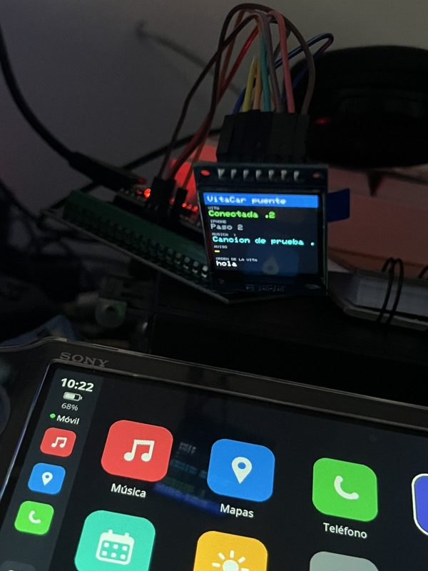
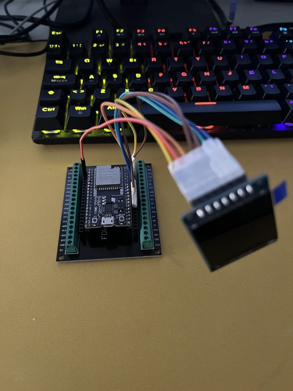
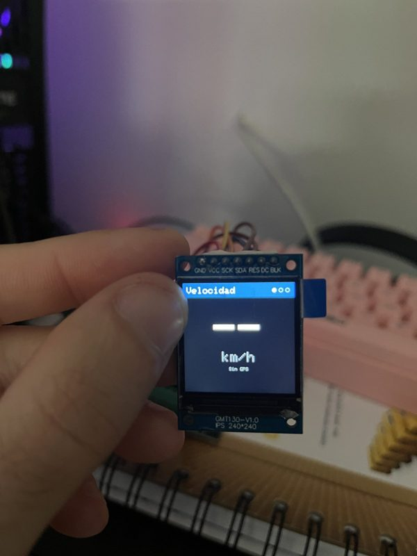
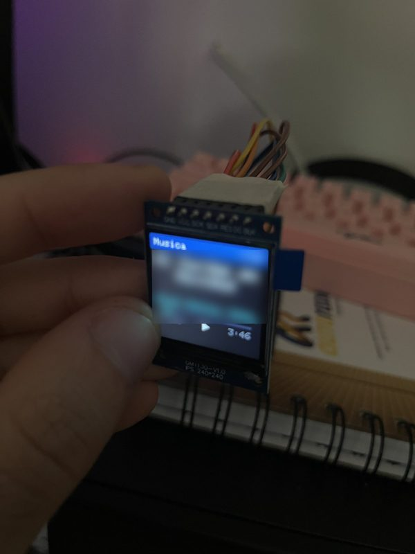

# VitaCar con iPhone: el puente ESP32

<p align="center">
  
  
</p>

**Versión del puente: 0.1 (en pruebas).** Necesita VitaCar 0.5.0 o posterior en la PS Vita.

Con un móvil Android no hace falta nada de esto: se usa la app VitaCar del móvil como siempre.

## Por qué hace falta una placa

iOS no deja que una app lea los avisos de otras apps ni sepa qué suena en Spotify, así que una
app de iPhone no puede hacer lo que hace la de Android. Pero Apple sí comparte todo eso por
Bluetooth con relojes y accesorios, con dos servicios oficiales: **ANCS** (avisos y llamadas) y
**AMS** (música). La PS Vita no tiene Bluetooth de bajo consumo, así que no puede hablar con
ellos directamente.

Una placa **ESP32** (unos 5-10 €, WiFi + Bluetooth) hace de «reloj» para el iPhone y le pasa
todo a la Vita por WiFi, con el mismo protocolo que la app de Android:

```
iPhone  --Bluetooth-->  ESP32  --WiFi-->  PS Vita
```

La placa crea su propia WiFi, así que no hace falta compartir internet. No hace falta Mac,
cuenta de desarrollador de Apple ni jailbreak, ni instalar nada en el iPhone (salvo una app
gratuita que se usa una vez para enlazar).

## Qué funciona con iPhone

Probado en una PS Vita real con un iPhone 13 (iOS 26) y Spotify.

| Sí | No (límites del iPhone o de la placa) |
|---|---|
| Avisos (WhatsApp, Mensajes, correo…): app, remitente y texto | Portadas de los discos (Apple no las manda por Bluetooth) |
| Llamada entrante con el nombre del contacto | Responder mensajes |
| Música de cualquier app, también Spotify: título, artista, duración, estado | Mapa, GPS, ruta, tiempo y notas nuevas en la agenda (la placa no tiene internet ni GPS) |
| Play/pausa, anterior y siguiente desde la Vita (táctil y botones) | Sonido por la Vita |
| Batería del iPhone | Indicaciones de Google Maps / Apple Maps |
| Reconexión sola al encender la placa | |

**En pruebas:** contestar, rechazar y colgar llamadas desde la Vita todavía no funciona. Contesta
en el iPhone o con el manos libres del coche.

**El sonido no sale por la Vita.** La Vita muestra la canción, los avisos y quién llama, y hace de
mando. La música y la voz de las llamadas salen del iPhone: conéctalo también al coche (Bluetooth,
AUX o USB) o usa auriculares. Las dos conexiones Bluetooth (placa y coche) funcionan a la vez.

## Qué hace falta

| Pieza | Precio aprox. | |
|---|---|---|
| ESP32 DevKit V4 (ESP32-WROOM-32) o parecida | 5-10 € | Obligatoria. ESP32 «normal»: las ESP32-S2 y C3 no sirven sin cambios |
| Cable USB de datos, corto | — | Obligatorio. Algunos cables solo cargan |
| Pantalla 1,3" 240×240 ST7789 (p. ej. GMT130-V1.0) | 3-6 € | Opcional |
| Adaptador de bornes de tornillo y 7 cables Dupont macho-hembra | 3-5 € | Opcional, para no soldar |
| App gratuita **nRF Connect for Mobile** (Nordic Semiconductor) en el iPhone | Gratis | Solo para el primer enlace |
| Un ordenador | — | Una vez, para grabar el programa |

## 1. Conectar la pantalla (opcional)

Siempre con el USB **desenchufado**. La placa funciona igual sin pantalla.

| Pantalla | ESP32 | Notas |
|---|---|---|
| GND | GND | |
| VCC | **3V3** | **Nunca a 5V**: la pantalla se puede quemar |
| SCK | GPIO18 | |
| SDA | GPIO23 | |
| RES | GPIO4 | |
| DC | GPIO16 | |
| BLK | GPIO17 | O sin conectar |

En algunas placas y adaptadores los pines se llaman «P18», «D18» o «IO18»: es lo mismo. Con
adaptador de tornillos, mete la punta entera en cada borne, aprieta y tira suave del cable para
comprobar que no se sale. Antes de enchufar, repasa que ninguna punta toque la de al lado.

## 2. Grabar el programa en la placa (una vez)

**Opción fácil, desde el navegador** (Chrome o Edge en el ordenador):

1. Descarga `VitaCar-puente-ESP32-0.1.bin` de [Releases](https://github.com/inigosui/VitaCar/releases).
2. Enchufa la placa y abre la herramienta oficial de Espressif:
   <https://espressif.github.io/esptool-js/>
3. Pulsa **Connect** y elige el puerto de la placa.
4. En *Flash Address* pon `0x0`, elige el archivo `.bin` y pulsa **Program**.
5. Cuando termine, desenchufa y vuelve a enchufar la placa.

**Opción para programadores, con PlatformIO:** abre la carpeta `esp32-bridge` en VS Code con la
extensión PlatformIO y pulsa *Upload*.

Problemas al grabar:

- Si se queda en «Connecting…», mantén pulsado el botón **BOOT** de la placa hasta que empiece.
- Windows o Mac no ven la placa: instala el controlador de su chip USB (CP210x, CH340 o CH9102;
  suele venir en la página del vendedor).
- Linux, «Permission denied»: `sudo usermod -aG dialout $USER` y vuelve a iniciar sesión.

## 3. Enlazar el iPhone (una vez)

La placa **no aparece** en Ajustes › Bluetooth hasta que está enlazada. Es normal. Se enlaza con
nRF Connect:

1. Con la placa enchufada, abre nRF Connect y pulsa **Scan**. Debe salir «VitaCar».
2. Pulsa **Connect**. El iPhone pide enlazar: pulsa **Enlazar**.
3. Si pregunta si VitaCar puede recibir las notificaciones, pulsa **Permitir**. Cierra nRF Connect.
4. En Ajustes › Bluetooth, VitaCar sale en «Mis dispositivos». En su (i), comprueba que
   **«Compartir notificaciones del sistema»** está activado.

Desde ahora el iPhone se conecta solo cada vez que se enciende la placa.

## 4. Conectar la Vita (una vez)

1. En la Vita: Ajustes › Red › Configuración de Wi-Fi › **VitaCar**. Contraseña: `vitacar2026`.
2. Abre VitaCar: encuentra la placa sola. El móvil sale como «iPhone (ESP32)».

Si la Vita no conecta y existe `ux0:data/VitaCar/phone_ip.txt`, bórralo (o escribe dentro
`192.168.4.1`). Si también usas VitaCar con un Android, elige en la Vita la WiFi de cada uno
según con cuál vayas.

## En el coche

- Enchufa la placa a un USB del coche o a un cargador de mechero. No hace falta ordenador.
  Mejor un cargador y un cable buenos: con poca corriente la placa se reinicia.
- El iPhone se conecta solo por Bluetooth y la Vita sola por WiFi.
- **Pantalla:** el botón **BOOT** cambia de página: Velocidad › Estado › Música. Los puntos de
  arriba a la derecha dicen en cuál estás, y la placa recuerda la última. Si entra una llamada,
  sale una franja roja abajo con el nombre. La velocidad sale como «--» hasta que se añada un
  módulo GPS (ver [Próximamente](#próximamente)).

<p align="center">
  
  
</p>

## Si algo falla

| Problema | Solución |
|---|---|
| La pantalla está en negro | Desenchufa y vuelve a enchufar. Revisa VCC, GND y BLK |
| Pantalla blanca sin texto | Revisa SCK, SDA, RES y DC |
| El ordenador ve la placa y la pierde cada segundo | Cable USB largo o malo: usa uno corto. Si sigue, revisa que VCC y GND no se toquen |
| No llegan avisos | «Compartir notificaciones del sistema» activado en la (i) de VitaCar, y la app que avisa con notificaciones permitidas |
| El iPhone no se reconecta | Apaga y enciende el Bluetooth del iPhone. Si sigue, «Omitir dispositivo» y repite el paso 3 |
| La Vita tarda en conectar | Puede tardar 10-20 s al abrir la app. Si no conecta, sal de VitaCar y vuelve a entrar |

Problemas conocidos: a veces el iPhone corta el Bluetooth tras unos minutos y vuelve a conectar
solo; seguimos investigando la causa.

## Próximamente

- **Módulo GPS** (NEO-6M, unos 5 €): velocidad real en la pantalla y posición en el mapa de la Vita.
- **Mapa sin internet** para iPhone: teselas de tu zona guardadas en la tarjeta de la Vita.
- **Modo punto de acceso** (opcional): placa y Vita en la WiFi del iPhone, para mapa, ruta y tiempo.
- Contestar llamadas desde la Vita y una conexión Bluetooth más estable.
- Una **carcasa impresa en 3D** para la placa y la pantalla: está mandada a imprimir y falta
  comprobar que todo encaja.

## Cambios

- **0.1** (10 oct 2026, con VitaCar 0.5.0): primera versión. Avisos, llamada entrante, música de
  cualquier app con controles desde la Vita y batería del iPhone. Pantalla opcional con tres
  páginas que se cambian con el botón BOOT.
